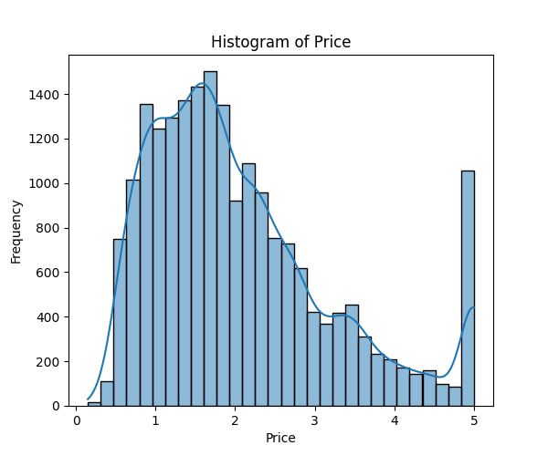

# House Price Prediction – California Housing Dataset
This project will predict house prices in California using machine learning regression approaches. The dataset with the features of Income, Age, Rooms, Bedrooms, Population, Occupancy, and Location, and the target variable of Price.

[](https://www.python.org/)
[](LICENSE)
## Project Overview

This project focuses on predicting house prices in California using regression models. It covers data exploration, preprocessing, regression modeling, assumption checking, and model evaluation. Both simple linear regression (using only Income) and multiple linear regression (using all features) are implemented.

## Dataset

**File:** <a href= "https://github.com/swetha0121/California-Housing-Price-Data-Analysis/blob/main/california_housing.csv">california_housing.csv</a>

**Features:**

- Income – Median income of households

- Age – Median house age

- Rooms – Average number of rooms

- Bedrooms – Average number of bedrooms

- Population – Population of block

- Occupancy – Average household occupancy

- Latitude & Longitude – Location

- Price – Median house value (target)

## Steps Performed

### Data Loading & Cleaning

- Checked missing values and duplicates.

- Cleaned data for analysis.

### Exploratory Data Analysis (EDA)

- Descriptive statistics.

- Histogram of Price, Scatter plot of Income vs Price.

- Correlation heatmap to identify important features.

### Preprocessing & Outlier Handling

- Scaled numeric features.

- Detected and removed extreme outliers.

### Train-Test Split

- Random 80-20 split.

- Stratified split based on Income bins to preserve distribution.

### Regression Modeling

- Simple Regression: Price ~ Income

- Multiple Regression: Price ~ all features

- Extracted coefficients and regression equations.

### Assumption Checks

- Linearity, independence, homoscedasticity, and residual normality.

### Model Evaluation

- Calculated MAE, MSE, RMSE, and R² for both models.

- Multiple regression performed better.

### Final Analysis

- Most influential features: Income, Rooms, Location

- Errors acceptable, assumptions mostly satisfied

## Key Findings

- Income is the strongest predictor of house prices.

- Multiple regression explains more variation in prices than simple regression.

- Stratified splitting ensures fair representation of income categories in train/test sets.


## 📈 Visualization Samples




### Scatter: Income vs Price
![Scatter Income Price]<a href= "Plots/Scatterplot of income vs price.png">image</a>
### Correlation Heatmap


## Tools Used

Python 3.10, Pandas, NumPy, Matplotlib, Seaborn

Scikit-learn for regression and preprocessing

SciPy for statistical plots.

## Conclusion

The project demonstrates how regression analysis can be used for predicting house prices. Multiple regression provides better predictive accuracy than using income alone. Proper data cleaning, outlier removal, and assumption validation make the model reliable.


## 📌 How to Run
**1. Clone this repository:**
**2.Install dependencies:**
**3.Run the Python script:**
Check outputs and plots in the plots/ folder
```bash

git clone https://github.com/swetha0121/California-Housing-Price-Data-Analysis.git my_project

pip install -r requirements.txt

cd House-Price-Prediction

python house_price_model.py


